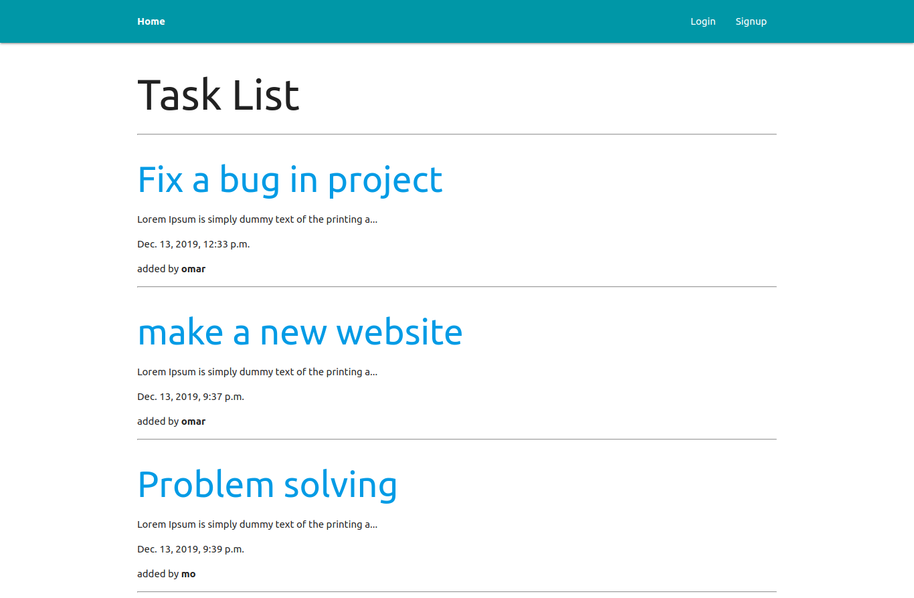
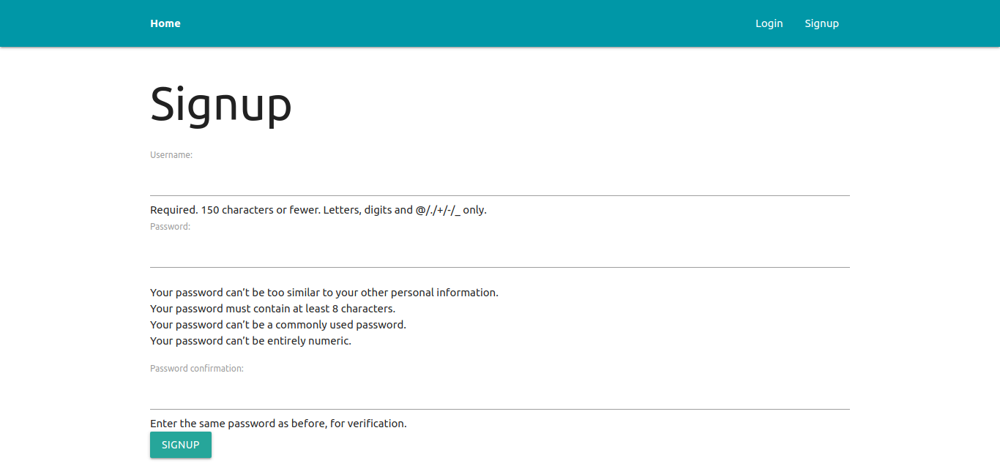
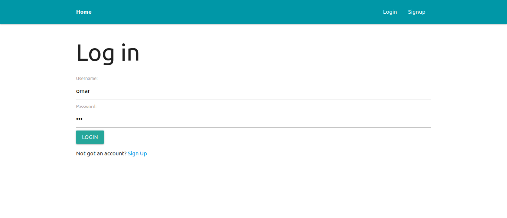
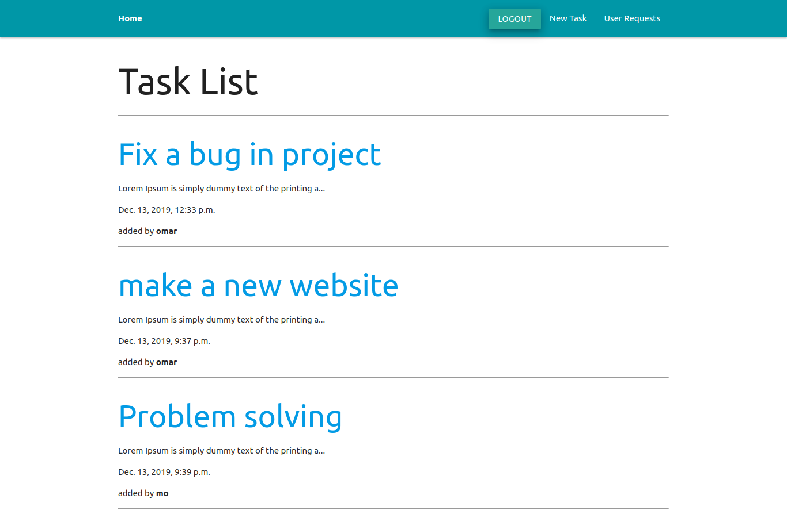
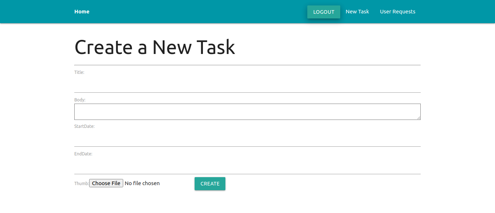
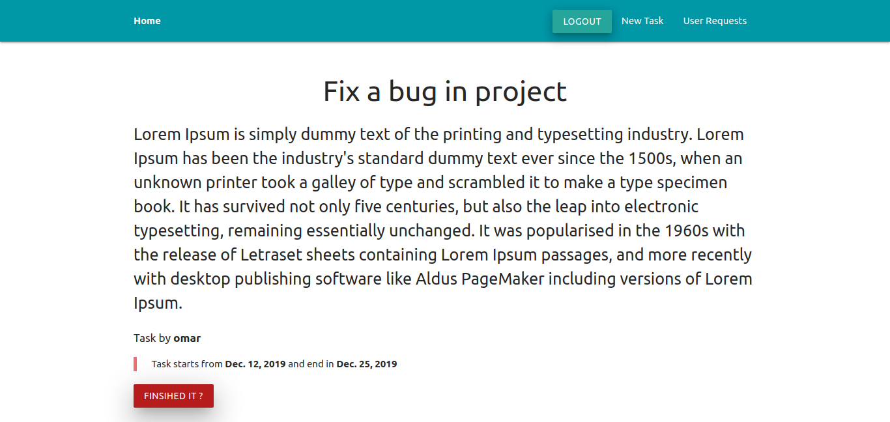
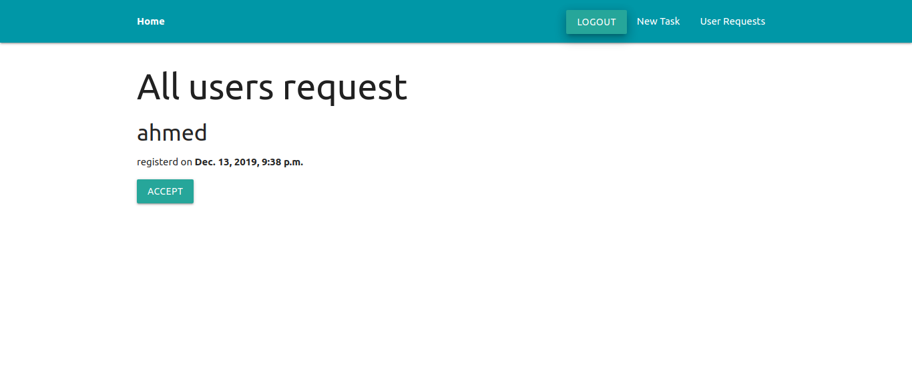

# Task-Management-System
##### the project written in python-3 and not python-2 
Task managmenet system with only one Admin.
in which this admin can accepet user requests to join the website
every user can create tasks and specifiy(title, start date and a deadline for it) and can delete the task once he finished it.

Technolgy and langues used:
<ul>
  <li>Python-3</li>
  <li>Dijango</li>
  <li>Sqlite3</li>
</ul>

### 🚀 Features
<ul>
  <li> Login/Register System </li>
  <li> superuser have the permission to accpet or deny new users </li>
  <li> once a superuser accepted a new user now he allow to create and post new tasks </li>
  <li> Create new task and decide the deadline for it </li>
  <li> Only the author of the task can flag that his own task finished and delete it </li>
</ul>

<h3>Demo</h3>

Mainpage for anonymous user

singup page

login page

Mainpage for superuser

create new task page

view task page "belongs to the same author"

**for superuser** accepting user requests

